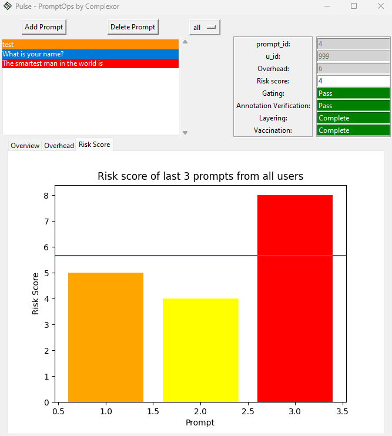
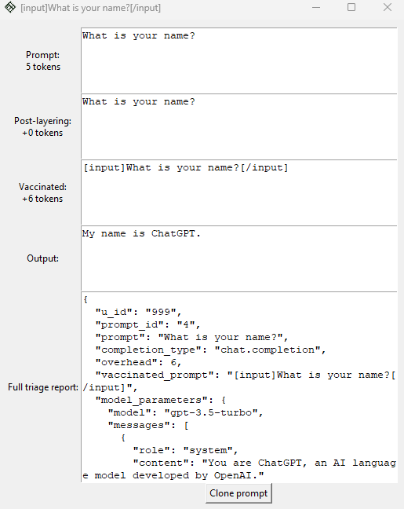
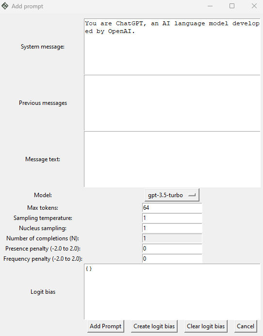

# Pulse

In today's world, where AI language models are becoming more prevalent, the need for prompt security engineering is critical. Pioneered by Complexor, prompt security engineering focuses on protecting against malicious input and developing tools and techniques to ensure that applications are resilient and reliable. Complexor's new product, Pulse, is designed to help prompt security engineers quickly assess the potential risk of prompts in an application's ecosystem.

By analyzing risk factors such as prompt source, content, and user behavior, this tool allows for effective prompt security integration to prevent prompt injection, deadzoning, and other adversarial attacks. With Pulse, prompt security engineers can stay one step ahead of potential threats to their AI language models. By leveraging PSEng principles and best practices, Pulse helps ensure that AI language models are resilient, secure, and able to withstand even the most sophisticated prompt attacks.

Pulse aims to be a game-changer for prompt security engineering, enabling teams to detect and mitigate prompt-based attacks faster and more effectively than ever before. With its intuitive interface and customizable features, Pulse makes prompt security engineering accessible to everyone, regardless of their level of expertise. Whether you're a seasoned security professional or a novice AI developer, Pulse gives you the tools you need to safeguard your language models and keep them secure in an ever-changing threat landscape.

### Current Features

* View triage reports of prompts as they move through the staging process
* See feed of overhead, risk score, and other triage results
* Filter by user id to identify potential malicious users
* Isolate and test prompts against the model
* Risk indicators for prompts for an at-a-glance
* Stage analyser - at-a-glance information on results of particular stages across filtered prompts
	* Overview
		* Gating: Number of blocked and rejected prompts
		* Annotation verification: Number of passes and errors
		* Total overhead
		* Vaccination: Average overhead and risk reduction

